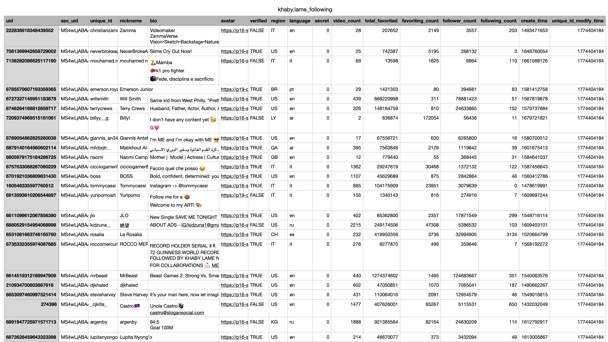

<p align="center">
  
</p>

# Tiktok Follower Following Crawler
[](https://github.com/tikfly/tiktok-follower-following-crawler/stargazers/)
[](https://github.com/tikfly/tiktok-follower-following-crawler/network/)
[](https://twitter.com)
[](https://github.com/tikfly/tiktok-follower-following-crawler)
[](https://mit-license.org/)

Get the maximum number of followers or following of a user on TikTok and save it to an CSV file ♪



## Getting Started

### Install requirements
Install the necessary libraries from the `requirements.txt` file
```bash
pip install -r requirements.txt
```

### Configuration
Before running the script, you need to configure some parameters in the `main.py` file. Open this file with a text editor and change the following values:

- `X_API_KEY`: Your API key used to authenticate requests to the Tikfly API. Get it from the official docs: https://docs.tikfly.io/getting-started/quickstart
- `UNIQUE_UD`: Tiktok username of the target account
- `TYPE`: Specifies which user list to fetch: *following* or *follower*
- `COUNT`: The maximum number of users to retrieve

### Running the Script
Once you have configured the parameters, you can run the script using the following command:

```bash
python main.py
```

### Results
The script will generate the results in the form of an CSV file, named `{UNIQUE_UD}_{TYPE}.csv`


## Example
You can go to `public/khaby.lame_following.csv` to see an example of Khaby Lame's following.

Here is data from the TikTok API. You can update the fields you want to retrieve in the function `extract_follower_following` in the `utils.py` file.

```json
{
  "accept_private_policy": false,
  "account_labels": null,
  "account_region": "",
  "ad_cover_url": null,
  "advance_feature_item_order": null,
  "advanced_feature_info": null,
  "apple_account": 0,
  "authority_status": 0,
  "avatar_168x168": {
    "height": 720,
    "uri": "tos-maliva-avt-0068/acdcc4d8e8390e04aa827d01f0ec161f",
    "url_list": [
      "https://p16-sign-va.tiktokcdn.com/tos-maliva-avt-0068/acdcc4d8e8390e04aa827d01f0ec161f~tplv-tiktokx-cropcenter:168:168.webp?dr=14633&refresh_token=e5ec9fdc&x-expires=1774411200&x-signature=%2BDH3LTY8oAtOPnVijFLD%2FwTlSlE%3D&t=4d5b0474&ps=82dc5187&shp=30310797&shcp=65db1d19&idc=my",
      "https://p16-sign-va.tiktokcdn.com/tos-maliva-avt-0068/acdcc4d8e8390e04aa827d01f0ec161f~tplv-tiktokx-cropcenter:168:168.jpeg?dr=14633&refresh_token=459c8f88&x-expires=1774411200&x-signature=mn6P2XYusbbh3gS0SXMloEa8Xg8%3D&t=4d5b0474&ps=82dc5187&shp=30310797&shcp=65db1d19&idc=my"
    ],
    "url_prefix": null,
    "width": 720
  },
  "avatar_300x300": {
    "height": 720,
    "uri": "tos-maliva-avt-0068/acdcc4d8e8390e04aa827d01f0ec161f",
    "url_list": [
      "https://p16-sign-va.tiktokcdn.com/tos-maliva-avt-0068/acdcc4d8e8390e04aa827d01f0ec161f~tplv-tiktokx-cropcenter:300:300.webp?dr=14633&refresh_token=c599e601&x-expires=1774411200&x-signature=da7f2AGvcIhoFOdaaJFCClYJOuM%3D&t=4d5b0474&ps=82dc5187&shp=30310797&shcp=65db1d19&idc=my",
      "https://p16-sign-va.tiktokcdn.com/tos-maliva-avt-0068/acdcc4d8e8390e04aa827d01f0ec161f~tplv-tiktokx-cropcenter:300:300.jpeg?dr=14633&refresh_token=ae9b377f&x-expires=1774411200&x-signature=tmY0oR2PWhOMyH68p8Y%2FMYqbOE0%3D&t=4d5b0474&ps=82dc5187&shp=30310797&shcp=65db1d19&idc=my"
    ],
    "url_prefix": null,
    "width": 720
  },
  "avatar_larger": {
    "height": 720,
    "uri": "tos-maliva-avt-0068/acdcc4d8e8390e04aa827d01f0ec161f",
    "url_list": [
      "https://p16-sign-va.tiktokcdn.com/tos-maliva-avt-0068/acdcc4d8e8390e04aa827d01f0ec161f~tplv-tiktokx-cropcenter:1080:1080.webp?dr=14635&refresh_token=e257ef17&x-expires=1774411200&x-signature=4oOhs%2BhHyT725ukrj3k%2FzLs4Dto%3D&t=4d5b0474&ps=82dc5187&shp=30310797&shcp=65db1d19&idc=my",
      "https://p16-sign-va.tiktokcdn.com/tos-maliva-avt-0068/acdcc4d8e8390e04aa827d01f0ec161f~tplv-tiktokx-cropcenter:1080:1080.jpeg?dr=14635&refresh_token=28725d04&x-expires=1774411200&x-signature=1jXyuWyjeJaHiLBnNcuzPe77Leg%3D&t=4d5b0474&ps=82dc5187&shp=30310797&shcp=65db1d19&idc=my"
    ],
    "url_prefix": null,
    "width": 720
  },
  "avatar_medium": {
    "height": 720,
    "uri": "tos-maliva-avt-0068/acdcc4d8e8390e04aa827d01f0ec161f",
    "url_list": [
      "https://p16-sign-va.tiktokcdn.com/tos-maliva-avt-0068/acdcc4d8e8390e04aa827d01f0ec161f~tplv-tiktokx-cropcenter:720:720.webp?dr=14635&refresh_token=1cd9472a&x-expires=1774411200&x-signature=VzkisCmoa7kAi%2FS03NWEBZyXDCs%3D&t=4d5b0474&ps=82dc5187&shp=30310797&shcp=65db1d19&idc=my",
      "https://p16-sign-va.tiktokcdn.com/tos-maliva-avt-0068/acdcc4d8e8390e04aa827d01f0ec161f~tplv-tiktokx-cropcenter:720:720.jpeg?dr=14635&refresh_token=686a0a72&x-expires=1774411200&x-signature=ptAM0sM4nJv1dfj0PpbiyEzWhAg%3D&t=4d5b0474&ps=82dc5187&shp=30310797&shcp=65db1d19&idc=my"
    ],
    "url_prefix": null,
    "width": 720
  },
  "avatar_thumb": {
    "height": 720,
    "uri": "tos-maliva-avt-0068/acdcc4d8e8390e04aa827d01f0ec161f",
    "url_list": [
      "https://p16-sign-va.tiktokcdn.com/tos-maliva-avt-0068/acdcc4d8e8390e04aa827d01f0ec161f~tplv-tiktokx-cropcenter:100:100.webp?dr=14635&refresh_token=2d9ffc1a&x-expires=1774411200&x-signature=NIBx2bAJ0%2BoDpoSOW%2B%2F2n9wEk50%3D&t=4d5b0474&ps=82dc5187&shp=30310797&shcp=65db1d19&idc=my",
      "https://p16-sign-va.tiktokcdn.com/tos-maliva-avt-0068/acdcc4d8e8390e04aa827d01f0ec161f~tplv-tiktokx-cropcenter:100:100.jpeg?dr=14635&refresh_token=728cbd09&x-expires=1774411200&x-signature=jkWr0PQKlyhI4wFUWNaKYb18TBI%3D&t=4d5b0474&ps=82dc5187&shp=30310797&shcp=65db1d19&idc=my"
    ],
    "url_prefix": null,
    "width": 720
  },
  "avatar_uri": "tos-maliva-avt-0068/acdcc4d8e8390e04aa827d01f0ec161f",
  "aweme_count": 28,
  "bind_phone": "",
  "bold_fields": null,
  "can_message_follow_status_list": null,
  "can_set_geofencing": null,
  "cha_list": null,
  "comment_filter_status": 0,
  "comment_setting": 0,
  "commerce_user_level": 0,
  "cover_url": [],
  "create_time": 1493471653,
  "custom_verify": "",
  "cv_level": "",
  "download_prompt_ts": 0,
  "download_setting": 0,
  "duet_setting": 0,
  "enabled_filter_all_comments": false,
  "enterprise_verify_reason": "",
  "events": null,
  "fake_data_info": {},
  "favoriting_count": 2146,
  "fb_expire_time": 0,
  "follow_status": 0,
  "follower_count": 3450,
  "follower_status": 0,
  "followers_detail": null,
  "following_count": 203,
  "friends_status": 0,
  "geofencing": null,
  "google_account": "",
  "has_email": false,
  "has_facebook_token": false,
  "has_insights": false,
  "has_orders": false,
  "has_twitter_token": false,
  "has_youtube_token": false,
  "hide_search": false,
  "homepage_bottom_toast": null,
  "ins_id": "christianzammataro",
  "is_ad_fake": false,
  "is_block": false,
  "is_discipline_member": false,
  "is_mute": 0,
  "is_mute_lives": 0,
  "is_mute_non_story_post": 0,
  "is_mute_story": 0,
  "is_phone_binded": false,
  "is_star": false,
  "item_list": null,
  "language": "en",
  "live_agreement": 0,
  "live_commerce": false,
  "live_verify": 0,
  "mention_status": 1,
  "mutual_relation_avatars": null,
  "need_points": null,
  "need_recommend": 0,
  "nickname": "Zamma",
  "original_musician": {
    "digg_count": 0,
    "music_count": 0,
    "music_used_count": 0,
    "new_release_clip_ids": null
  },
  "platform_sync_info": null,
  "prevent_download": false,
  "react_setting": 0,
  "region": "IT",
  "relative_users": null,
  "reply_with_video_flag": 4,
  "room_id": 0,
  "search_highlight": null,
  "sec_uid": "MS4wLjABAAAAZUDexX-Wq7YFVG8V5DCx40AnohGQorRgMT_4xd3fvfFjJjc3TNZUjCTq-izbWsH5",
  "secret": 0,
  "share_info": {
    "now_invitation_card_image_urls": null,
    "share_desc": "",
    "share_desc_info": "",
    "share_qrcode_url": {
      "height": 720,
      "uri": "",
      "url_list": [],
      "url_prefix": null,
      "width": 720
    },
    "share_title": "",
    "share_title_myself": "",
    "share_title_other": "",
    "share_url": ""
  },
  "share_qrcode_uri": "",
  "shield_comment_notice": 0,
  "shield_digg_notice": 0,
  "shield_edit_field_info": null,
  "shield_follow_notice": 0,
  "short_id": "0",
  "show_image_bubble": false,
  "signature": "Videomaker\nZammaVerse\nVision•Sketch•Backstage•Nature•Prod•Card",
  "special_account": {
    "special_account_list": null
  },
  "special_lock": 1,
  "status": 1,
  "stitch_setting": 0,
  "total_favorited": 207463,
  "tw_expire_time": 0,
  "twitter_id": "",
  "twitter_name": "",
  "type_label": null,
  "uid": "222838918348439552",
  "unique_id": "christianzammataro",
  "unique_id_modify_time": 1774325412,
  "user_canceled": false,
  "user_mode": 1,
  "user_period": 0,
  "user_profile_guide": null,
  "user_rate": 1,
  "user_spark_info": {},
  "user_tags": null,
  "verification_type": 1,
  "verify_info": "",
  "video_icon": {
    "height": 720,
    "uri": "",
    "url_list": [],
    "url_prefix": null,
    "width": 720
  },
  "white_cover_url": null,
  "with_commerce_entry": false,
  "with_shop_entry": false,
  "youtube_channel_id": "",
  "youtube_channel_title": "",
  "youtube_expire_time": 0
}
```

## Contact

If you have questions, suggestions, or collaboration ideas

Open an issue
Or contact via your preferred channel
